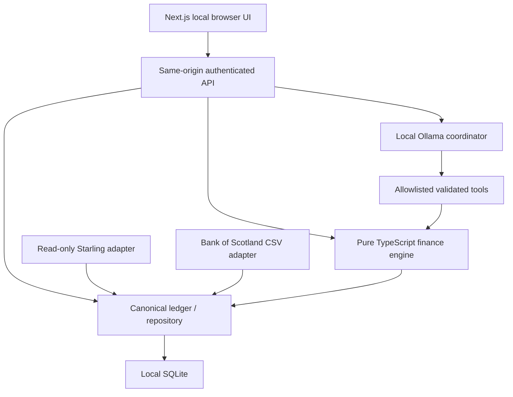

# Architecture and data model

## Boundaries
`src/domain` contains pure calculations, date/money validation and canonical types. `src/providers` converts provider payloads into our ledger contract. `src/server` owns persistence, request security and AI orchestration. `src/app` owns the Next.js presentation and API boundary. No browser imports of repository, token handling or AI clients. The server-only route is the sole entry point. Provider changes do not alter the engine or UI contract.

## SQLite schema v1
- **accounts**: id and canonical JSON (provider, name, GBP, cleared and available pence, balance freshness timestamp).
- **transactions**: stable primary key, account foreign key and canonical JSON (booked date, signed pence, merchant, category, financial role, pending, corrected). Starling identities include account/feed UID. CSV identities hash account/date/description/amount/occurrence.
- **rules**: ordered merchant-substring matching, category and role. Individual corrections override every rule.
- **plans**: explicit monthly cash flows, signed amount, day, inclusive start/end, category and role. These form the forecast assumptions.
- **scenarios**: saved validated scenario inputs. Calculations are reproducible from opening cash and the plan set at execution; versioned forecast snapshots are a future milestone.
- **audit**: timestamp, action and record count, without descriptions or secrets. Local audit is not tamper-proof.
- **settings**: demo marker. **schema_version**: migration baseline.

JSON rows keep this early scaffold simple. Queries currently read the personal ledger in memory. Before large histories, migrate indexed booked dates/amounts/categories into typed columns and implement bounded repository queries. Preserve the canonical contracts when replacing SQLite with PostgreSQL. v1 migrations are idempotent; future migrations must be explicit and backed up.

## Financial semantics
Only integer GBP pence enters the calculation engine. Debits are negative, credits positive. Spending nets positive refunds within the same category and excludes income, transfers and pending entries. Transfer pairing is manual in v1; correct both legs to Transfers/transfer. Investments and savings are cash outflows, not consumption. No securities are counted as immediately available cash.

Recurrence needs at least three settled observations from the same merchant, account and direction; interval and amount tolerances are explicit. Candidates are heuristic and may be stale; they never silently become commitments. Monthly date predictions use the last observed day, which may drift after February; review due dates manually. Annual/fortnightly schedules are future work.

Forecasting is deterministic and plan-based, not learned prediction. It clamps days 29–31 to month end, honours plan dates, applies outflows before inflows on a day, and measures the lowest within-day cash as well as daily closes. Opening cash is current available balance, with no transaction replay. Set the forecast start to that balance date. A housing scenario replaces Rent, Council tax and Utilities only from its start; broadband and other obligations remain. All three replacement costs share the housing start day. Enter overlap, deposit, travel and other one-offs explicitly. Safe-to-spend is max(0, lowest cash minus reserve), conditional on a complete plan set.

## AI trust boundary
Ollama runs only at fixed loopback `127.0.0.1:11434`; model is an operator-configured local model. Native tool calls receive schema validation and an allowlist. Four rounds, four calls per round, a 60-second request timeout and a token output limit bound execution. The local API serialises work to avoid overlapping requests. Tools expose aggregate balances, spending categories, redacted recurring candidates and forecasts. No arbitrary SQL, file reads, URL fetching or writes. Tokens and raw transaction descriptions never enter prompts; user questions still may contain sensitive text. The UI shows tool evidence in pence. The LLM's prose is untrusted and cannot be guaranteed to faithfully repeat evidence.

## Security and connectivity limits
Bind the server to loopback. The browser holds an access key in memory, sent in a header. Every API request checks secret, host and origin; no default unlocked mode, CORS or unauthenticated ledger endpoint. Static initial HTML contains no bank data. No secret logging or provider response bodies are returned. Browser responses are no-store; pages deny framing. This is not hardened multi-user authentication. CSP permits inline scripts for Next.js; nonce-based CSP is a future hardening step.

Token is server environment only, not stored in SQLite. `.env.local` and all databases are ignored. Windows user permissions and device encryption must protect local files; SQLite is not encrypted by this app. Read-only PAT scopes should be account:read, balance:read and transaction:read; revoke in Starling's portal. Adapter has no payment methods and only fixed-host GET calls. First API run is not live-verified; integration tests use mocks. Only GBP current accounts/default feed are covered; Spaces, cards, assets and liabilities are not consolidated. Manual sync has no scheduler. Cancelled/reversed provider feed statuses are not fully reconciled in v1; review pending items and bank balances. Do not treat cash summaries as complete until these limitations are resolved against your accounts.

CSV repeated full-file imports are idempotent. CSV has no bank transaction UID: overlapping partial exports with multiple identical same-day purchases are ambiguous; compare preview with existing entries. Import is atomic and rejects any row errors. It records a manually supplied current balance separately rather than deriving a current balance from an incomplete statement.
